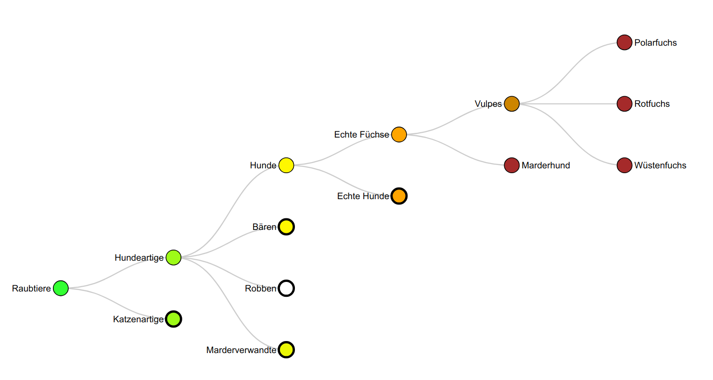
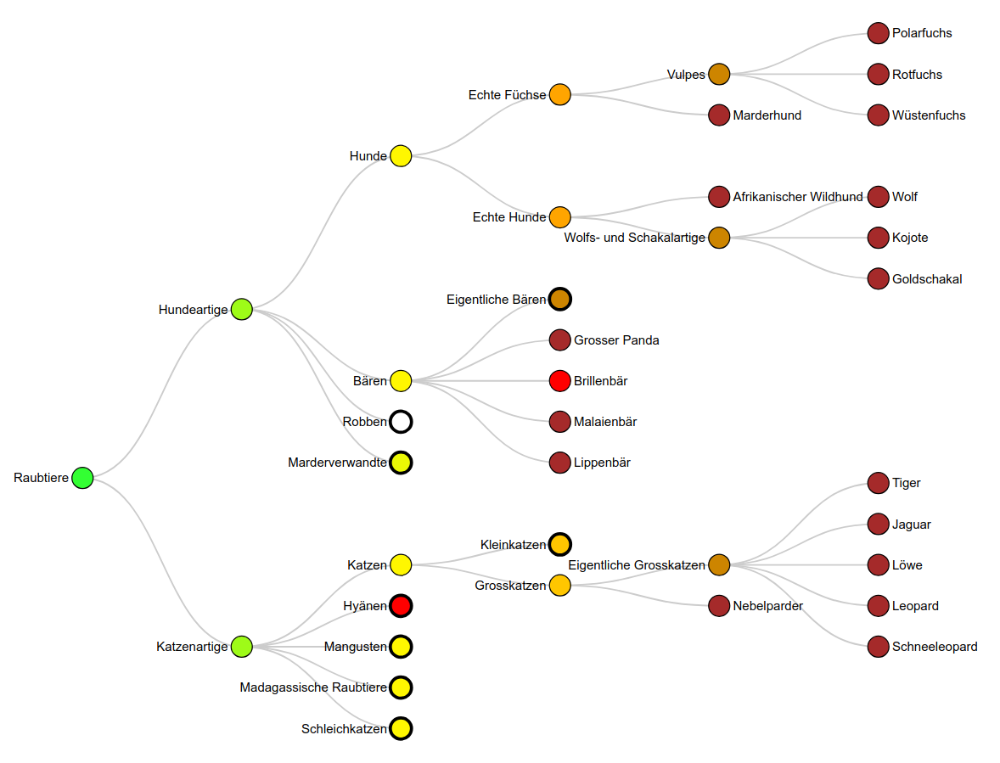

<!-- README.md is generated from README.Rmd. Please edit that file -->

```{r, include = FALSE}
library(simpleTaxonomy)
library(dplyr)

knitr::opts_chunk$set(
  collapse = TRUE,
  comment = "#>",
  fig.path = "man/figures/README-",
  out.width = "100%"
)
```

# simpleTaxonomy 

<!-- badges: start -->
<!-- badges: end -->

## Overview

simpleTaxonomy offers simple tools to create interactive visualisations of
[taxonomic hierarchies](https://en.wikipedia.org/wiki/Taxonomy_(biology)), which are specified in a csv-file with a simple structure.

## Installation

You can install the development version of simpleTaxonomy from [GitHub](https://github.com/) with:

``` r
# install.packages("pak")
pak::pak("stibu81/simpleTaxonomy")
```

## Example

The package includes an example file with some taxa from the order
[Carnivora](https://en.wikipedia.org/wiki/Carnivora). The file is in German.
It can be read and visualised as follows:

```{r example, eval=FALSE}
library(simpleTaxonomy)

taxonomy_file <- get_example_taxonomy_file()
taxonomy <- read_taxonomy(taxonomy_file)
plot_taxonomy(taxonomy, show = "Rotfuchs")
```



Nodes can be opened and closed by clicking on them. On hovering over a node,
a tooltip opens with additional information and possibly an image.
See [here](https://stibu81.github.io/taxonomyData/)
for a working interactive example of a more complete taxonomy.


## Input data

You can get the path to the example file that is included in the
package with

```{r eval=FALSE}
get_example_taxonomy_file()
#> [1] ".../library/simpleTaxonomy/example/carnivora.csv"
```

These are the first few lines of the file:

```{r echo=FALSE, comment=""}
file <- readLines(get_example_taxonomy_file(), n = 10)
cat(file, sep = "\n")
```

Each line defines a taxon with these five columns:

* parent: the common name of the parent of the current taxon. There must
  be exactly one row where this column is empty, which will be the root
  of the tree. In the example file, this is the first row.
* name: the common name of the taxon that is defined by the row.
* scientific: the scientific name of the taxon.
* rank: the rank of the taxon.
* image_url: the URL to an image of the current taxon. This column is optional
  and image URLs can be filled in automatically from Wikipedia.

The order of the rows is irrelevant. For the tree to be valid, there must be
exactly one root taxon, which has no parent. In addition, all taxa that
are used as parents must also be defined in their own row. The common names of
the taxa (column `name`) as well as the scientific names (column `scientific`)
must be unique.

Currently, only German ranks are supported. You can obtain the list of
supported ranks as follows:

```{r}
available_ranks()
```

Ranks not contained in this list may be used, but they will not be coloured
in the visualisation.

Sometimes, several taxa have the same common name. An example are the
family Equidae and the genus Equus, which in German are both called "Pferde"
(horses). These taxa can be distinguished by adding an identifier in 
parenthesis. So, we could name the family and the genus "Pferde (F)" and
"Pferde", respectively, to make them unique. The identifier will be used to
distinguish the two taxa when building the structure of the tree, but it will
not be shown in the visualisation.


## Reading the input data

The input data can be read using the function `read_taxonomy()`. The following
snippet reads the example file from the package, but you can read your own
file in the same way.

```{r}
taxonomy_file <- get_example_taxonomy_file()
taxonomy <- read_taxonomy(taxonomy_file)
```

The resulting object is a `taxonomy_graph` which is basically an
[igraph](https://r.igraph.org/) object.

```{r}
class(taxonomy)
```

Printing the object shows a summary of its properties:

```{r}
taxonomy
```


## Adding image URLs from Wikipedia

The function `enrich_taxonomy_with_images()` can be used to add image URLs
from Wikipedia. It uses the Wikipedia API to obtain the URLs of the thumbnails
associated with the Wikipedia pages corresponding to the common name or, if it
is not found, the scientific name. The function must be called with the path
to the *input file*, not a `taxonomy_graph`, because it writes the image URLs
back to the file. The function prints a short summary to inform the user about
how many images could be found and it returns the `taxonomy_graph` with the
image URLs.

```{r eval=FALSE}
taxonomy <- enrich_taxonomy_with_images(taxonomy_file)
#> try to get images for 23 taxa.
#> found:  21
#> failed:  2
```

Taxa, where not image could be found, will be marked by "not_found" in the
column `image_url`.


## Visualising the taxonomy graph

The taxonomy graph can be visualised using `plot_taxonomy()`. By default, only
the root node will be expanded, but the function offers several arguments to
expand more nodes. The following example uses `show` to expand the tree up to
the taxa "Grosser Panda" and "Löwe". In addition, `full_expand` is used to
show all the taxa below "Hunde". Note that `full_expand` does not expand the
nodes up to "Hunde", but in this case, "Hunde" is visible because of the
expansion up to "Grosser Panda". The argument `highlight` is used to highlight
some taxa in red.

```{r example2, eval=FALSE}
plot_taxonomy(taxonomy,
              show = c("Grosser Panda", "Löwe"),
              full_expand = "Hunde",
              highlight = c("Brillenbär", "Hyänen"))
```




## taxonomyData {#taxonomyData}

A growing taxonomic hierarchy in German can be found on
[GitHub](https://github.com/stibu81/taxonomyData). The file can be read directly
from GitHub as follows:

```{r}
url <- paste0("https://raw.githubusercontent.com/",
              "stibu81/taxonomyData/refs/heads/main/taxonomy.csv")
taxonomy <- read_taxonomy(url)
```

A visualisation of the current state of the taxonomic hierarchy is also
available [here](https://stibu81.github.io/taxonomyData/).


## Shiny App

simpleTaxonomy comes with a Shiny app that allows to interact with a taxonomic
hierarchy. It can be run by

```{r eval=FALSE}
run_taxonomy()
```

This will by default use the taxonomic hierarchy described in the
[previous section](#taxonomydata). But you can also run it with any other
file by passing the path to the file as the first argument. This will run the
app with the example data contained in the package:

```{r eval=FALSE}
run_taxonomy(get_example_taxonomy_file())
```
