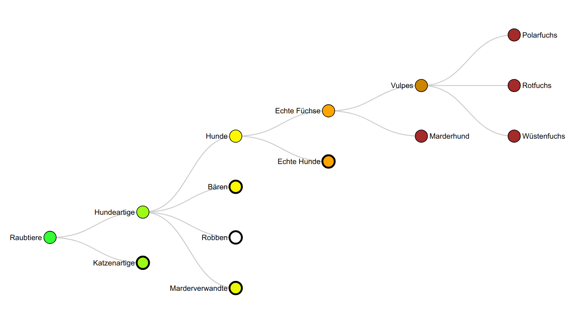
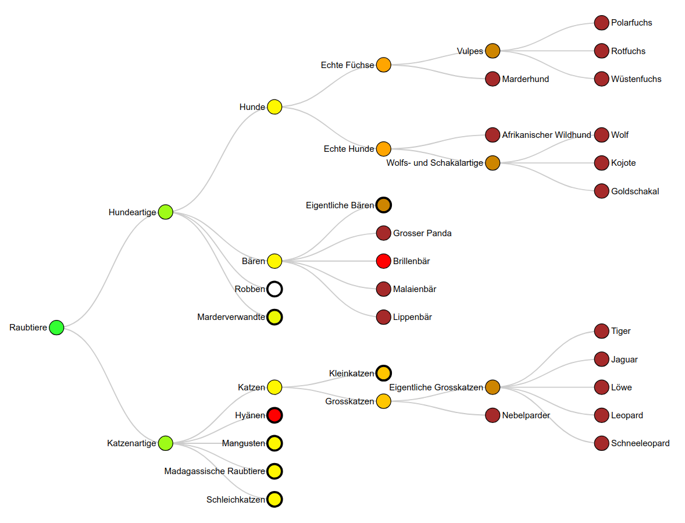

<!-- README.md is generated from README.Rmd. Please edit that file -->

# simpleTaxonomy <a href="https://stibu81.github.io/simpleTaxonomy/"></a>

<!-- badges: start -->
<!-- badges: end -->

## Overview

simpleTaxonomy offers simple tools to create interactive visualisations
of [taxonomic
hierarchies](https://en.wikipedia.org/wiki/Taxonomy_(biology)), which
are specified in a csv-file with a simple structure.

## Installation

You can install the development version of simpleTaxonomy from
[GitHub](https://github.com/) with:

``` r
# install.packages("remotes")
remotes::install_github("stibu81/simpleTaxonomy")
```

## Example

The package includes an example file with some taxa from the order
[Carnivora](https://en.wikipedia.org/wiki/Carnivora). The file is in
German. It can be read and visualised as follows:

``` r
library(simpleTaxonomy)

taxonomy_file <- get_example_taxonomy_file()
taxonomy <- read_taxonomy(taxonomy_file)
plot_taxonomy(taxonomy, show = "Rotfuchs")
```



Nodes can be opened and closed by clicking on them. On hovering over a
node, a tooltip opens with additional information and possibly an image.
See [here](https://stibu81.github.io/taxonomyData/) for a working
interactive example of a more complete taxonomy.

## Input data

You can get the path to the example file that is included in the package
with

``` r
get_example_taxonomy_file()
#> [1] ".../library/simpleTaxonomy/example/carnivora.csv"
```

These are the first few lines of the file:

    parent,name,scientific,rank,image_url
    ,Raubtiere,Carnivora,Ordnung,https://upload.wikimedia.org/wikipedia/commons/thumb/d/d7/Stud_327_with_Blesbuck.jpg/100px-Stud_327_with_Blesbuck.jpg
    Raubtiere,Hundeartige,Caniformia,Unterordnung,https://upload.wikimedia.org/wikipedia/commons/thumb/5/51/Canis_mesomelas_vs._Arctocephalus_pusillus.jpg/100px-Canis_mesomelas_vs._Arctocephalus_pusillus.jpg
    Hundeartige,Hunde,Canidae,Familie,https://upload.wikimedia.org/wikipedia/commons/thumb/1/1b/NIEdot306.jpg/100px-NIEdot306.jpg
    Hunde,Echte Füchse,Vulpini,Tribus,https://upload.wikimedia.org/wikipedia/commons/thumb/d/d0/Vulpes_vulpes_standing_in_snow.jpg/100px-Vulpes_vulpes_standing_in_snow.jpg
    Echte Füchse,Vulpes,Vulpes,Gattung,https://upload.wikimedia.org/wikipedia/commons/thumb/0/03/Vulpes_vulpes_laying_in_snow.jpg/100px-Vulpes_vulpes_laying_in_snow.jpg
    Vulpes,Polarfuchs,Vulpes lagopus,Art,https://upload.wikimedia.org/wikipedia/commons/thumb/c/cb/Alopex_lagopus_qtl1.jpg/100px-Alopex_lagopus_qtl1.jpg
    Vulpes,Rotfuchs,Vulpes vulpes,Art,https://upload.wikimedia.org/wikipedia/commons/thumb/b/bc/Vulpes_vulpes_1_%28Martin_Mecnarowski%29.jpg/100px-Vulpes_vulpes_1_%28Martin_Mecnarowski%29.jpg
    Vulpes,Wüstenfuchs,Vulpes zerda,Art,https://upload.wikimedia.org/wikipedia/commons/thumb/9/9f/Fennec_Fox_Vulpes_zerda.jpg/100px-Fennec_Fox_Vulpes_zerda.jpg
    Echte Füchse,Marderhund,Nyctereutes procyonoides,Art,https://upload.wikimedia.org/wikipedia/commons/thumb/3/36/%D0%95%D0%BD%D0%BE%D1%82%D0%BE%D0%B2%D0%B8%D0%B4%D0%BD%D0%B0%D1%8F_%D1%81%D0%BE%D0%B1%D0%B0%D0%BA%D0%B0_%D0%93%D1%80%D0%BE%D0%B4%D0%BD%D0%BE_%28cropped_2%29.jpg/100px-%D0%95%D0%BD%D0%BE%D1%82%D0%BE%D0%B2%D0%B8%D0%B4%D0%BD%D0%B0%D1%8F_%D1%81%D0%BE%D0%B1%D0%B0%D0%BA%D0%B0_%D0%93%D1%80%D0%BE%D0%B4%D0%BD%D0%BE_%28cropped_2%29.jpg

Each line defines a taxon with these five columns:

- parent: the common name of the parent of the current taxon. There must
  be exactly one row where this column is empty, which will be the root
  of the tree. In the example file, this is the first row.
- name: the common name of the taxon that is defined by the row.
- scientific: the scientific name of the taxon.
- rank: the rank of the taxon.
- image_url: the URL to an image of the current taxon. This column is
  optional and image URLs can be filled in automatically from Wikipedia.

The order of the rows is irrelevant. For the tree to be valid, there
must be exactly one root taxon, which has no parent. In addition, all
taxa that are used as parents must also be defined in their own row. The
common names of the taxa (column `name`) as well as the scientific names
(column `scientific`) must be unique.

Currently, only German ranks are supported. You can obtain the list of
supported ranks as follows:

``` r
available_ranks()
#> # A tibble: 21 × 2
#>    level de         
#>    <int> <chr>      
#>  1     1 Lebewesen  
#>  2     2 Domäne     
#>  3     3 Reich      
#>  4     4 Stamm      
#>  5     5 Unterstamm 
#>  6     6 Überklasse 
#>  7     7 Klasse     
#>  8     8 Unterklasse
#>  9     9 Teilklasse 
#> 10    10 Überordnung
#> # ℹ 11 more rows
```

Ranks not contained in this list may be used, but they will not be
coloured in the visualisation.

Sometimes, several taxa have the same common name. An example are the
family Equidae and the genus Equus, which in German are both called
“Pferde” (horses). These taxa can be distinguished by adding an
identifier in parenthesis. So, we could name the family and the genus
“Pferde (F)” and “Pferde”, respectively, to make them unique. The
identifier will be used to distinguish the two taxa when building the
structure of the tree, but it will not be shown in the visualisation.

## Reading the input data

The input data can be read using the function `read_taxonomy()`. The
following snippet reads the example file from the package, but you can
read your own file in the same way.

``` r
taxonomy_file <- get_example_taxonomy_file()
taxonomy <- read_taxonomy(taxonomy_file)
```

The resulting object is a `taxonomy_graph` which is basically an
[igraph](https://r.igraph.org/) object.

``` r
class(taxonomy)
#> [1] "taxonomy_graph" "igraph"
```

Printing the object shows a summary of its properties:

``` r
taxonomy
#> taxonomy_graph with 96 nodes.
#> root node: Raubtiere 
#> tree depth: 6 
#> number of leaves: 63 
#> graph has image url for 95 nodes.
#> 
#> most common ranks:
#>  rank         n 
#>  Art          57
#>  Familie      14
#>  Gattung      13
#>  Unterart      3
#>  Unterordnung  2
#>  Unterfamilie  2
#>  Tribus        2
```

## Adding image URLs from Wikipedia

The function `enrich_taxonomy_with_images()` can be used to add image
URLs from Wikipedia. It uses the Wikipedia API to obtain the URLs of the
thumbnails associated with the Wikipedia pages corresponding to the
common name or, if it is not found, the scientific name. The function
must be called with the path to the *input file*, not a
`taxonomy_graph`, because it writes the image URLs back to the file. The
function prints a short summary to inform the user about how many images
could be found and it returns the `taxonomy_graph` with the image URLs.

``` r
taxonomy <- enrich_taxonomy_with_images(taxonomy_file)
#> try to get images for 23 taxa.
#> found:  21
#> failed:  2
```

Taxa, where not image could be found, will be marked by “not_found” in
the column `image_url`.

## Visualising the taxonomy graph

The taxonomy graph can be visualised using `plot_taxonomy()`. By
default, only the root node will be expanded, but the function offers
several arguments to expand more nodes. The following example uses
`show` to expand the tree up to the taxa “Grosser Panda” and “Löwe”. In
addition, `full_expand` is used to show all the taxa below “Hunde”. Note
that `full_expand` does not expand the nodes up to “Hunde”, but in this
case, “Hunde” is visible because of the expansion up to “Grosser Panda”.
The argument `highlight` is used to highlight some taxa in red.

``` r
plot_taxonomy(taxonomy,
              show = c("Grosser Panda", "Löwe"),
              full_expand = "Hunde",
              highlight = c("Brillenbär", "Hyänen"))
```



## taxonomyData

A growing taxonomic hierarchy in German can be found on
[GitHub](https://github.com/stibu81/taxonomyData). The file can be read
directly from GitHub as follows:

``` r
url <- paste0("https://raw.githubusercontent.com/",
              "stibu81/taxonomyData/refs/heads/main/taxonomy.csv")
taxonomy <- read_taxonomy(url)
#> ! There are invalid ranks:  "Kohorte". The corresponding nodes will not be coloured.
```

A visualisation of the current state of the taxonomic hierarchy is also
available [here](https://stibu81.github.io/taxonomyData/).

## Shiny App

simpleTaxonomy comes with a Shiny app that allows to interact with a
taxonomic hierarchy. It can be run by

``` r
run_taxonomy()
```

This will by default use the taxonomic hierarchy described in the
[previous section](#taxonomydata). But you can also run it with any
other file by passing the path to the file as the first argument. This
will run the app with the example data contained in the package:

``` r
run_taxonomy(get_example_taxonomy_file())
```
